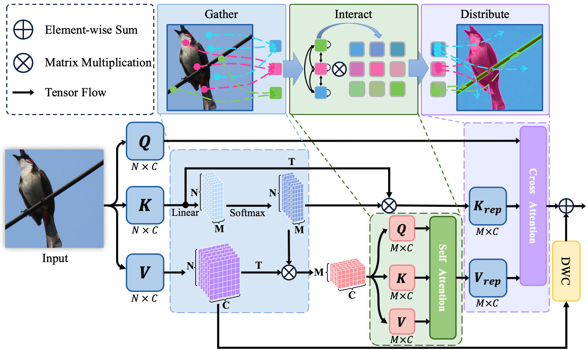
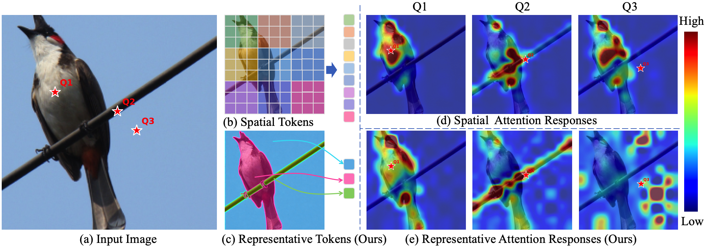
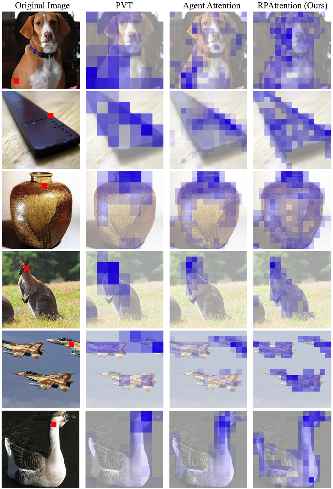

# RPAtten

Official repository for **RPAttention**.

This repository will host the PyTorch implementation, training configurations,
and pretrained models for RPAttention after the paper is accepted.

  

RPAttention follows a **Gather-Interact-Distribute** design: spatial tokens are
gathered into compact representative tokens, globally interacted in the compact
token space, and distributed back to the original token sequence.

## Status

Code and checkpoints are coming soon.

## Visualizations

  

  

## Planned Release

We plan to release:

- ImageNet-1K classification code and configs
- COCO object detection configs
- ADE20K semantic segmentation configs
- Pretrained checkpoints and evaluation instructions

## Citation

The citation will be added after the paper or preprint is available.

## Acknowledgements

Our code is developed on top of
[Agent-Attention](https://github.com/leaplabthu/agent-attention).

This work was supported by computational resources from TPU Research
Cloud (TRC).

## Contact

For questions, please contact lytong@tju.edu.cn.
